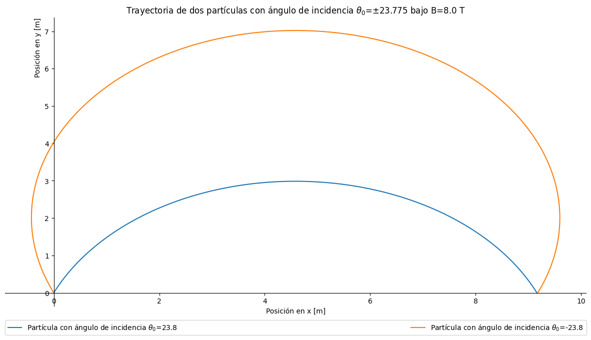

## Aceleradores de Partículas y sus Aplicaciones
### Proyecto 1: Espectrómetro de momentos
> Elaborado por: Juan Daniel Castrellón Botero (201729285) y María Sofía Álvarez López (201729031)

  <h4>
    <a href="#intro">
      Introducción al proyecto
    </a>
     | 
    <a href=#correr>
      Correr el proyecto
    </a>
     | 
    <a href=#correr-parte-1>
      Correr la parte 1
    </a>
     | 
     <a href=#correr-parte-2>
      Correr la parte 2
    </a>
  </h4>

***
<h2 name="intro">Introducción al proyecto</h2>

 
  El objetivo de este proyecto fue el de simular la trayectoria de una partícula cargada en un espectrómetro de momentos. Asimismo, se verificó que el radio de una partícula cargada depende de su momento. Además, se quiso indagar en la propiedad de enfoque que tiene el espectrómetro, según lo propuesto por Feynman en su volumen 2 del Feynman Lectures on Physics, capítulo 29. 

  Con el fin de lograr el objetivo propuesto, se crearon dos programas en el lenguaje de programación Python. El primero simula una partícula que incide perpendicularmente a la base del espectrómetro, es decir, tiene una velocidad en la dirección <i>j</i>. Por su lado, el campo magnético tenía una magnitud B=8T en dirección <i>k</i>. El objetivo de este programa era verificar que el momento de la partícula al entrar al espectrómetro, calculado como |p| = m|v|, es el mismo al salir, calculado según la ecuación |p| = q|B|R, donde <i>B</i> es el campo magnético, <i>R</i> el radio de la trayectoria semicircular que sigue la partícula y q = 5 C la carga de la partícula. El radio de la partícula se calculó con la distancia x_final a la que sale la partícula del espectrómetro, medida desde su punto de entrada, teniendo en cuenta que x_final = 2R. El código implementado para llevar a cabo este objetivo se encuentra en el archivo <code>parte1/parte1.py</code>.

 En el segundo programa se simulan partículas que entran con un ángulo de incidencia theta_0 medido respecto al eje y. Para este caso se estudiaron dos escenarios. El primero consistía en variar la velocidad de salida mientras se mantenía constante theta_0  y el segundo que variaba theta_0, manteniendo constante la magnitud de la velocidad. Para cada partícula que salía con un ángulo theta_0 se simulaba una segunda que incidía en un ángulo -theta_0. El campo magnético se aplicó nuevamente con una magnitud B=8T en la dirección k con una carga de magnitud q = 5C. En teoría, el punto donde finalizan ambas trayectorias debe coincidir, lo cual genera un efecto de enfoque. El montaje se puede ver en la figura mostrada a continuación. El archivo que contiene el código está en el repositorio que se encuentra al final del documento en el archivo <code>parte2/parte2.py</code>.
 

<h2 name="correr">Correr el proyecto</h2>

 
  Con el fin de correr este repositorio, deben seguirse los pasos mostrados a continuación. 

<ol>
<li> Antes de correr el proyecto, asegúrese de tener instalado <code>python3</code> en su máquina local y <code>pip</code> o <code>pip3</code> para instalar las dependencias y librerías necesarias para la ejecución del programa. Si no cuenta con alguno de estos, puede instalarlos remitiéndose a <a href=https://www.python.org/downloads/>la documentación oficial de python</a> para instalar <code>python3</code>, con lo que se instalará una distribuión de <code>pip</code></li>
<li> Corra el archivo <code>./run.sh</code>. En caso de que le salga el error <i>Permission denied</i> ejecute alguno de los comandos mostrados a continuación.
  <ul>
    <li><code>sudo ./run.sh</code></li>
    <li><code>chmod 777 ./run.sh</code></li>
  </ul>
  Lo cual dará los permisos de ejecución necesarios para correr el programa.
</li>
<li>Una vez corrido el programa, se le mostrarán las opciones disponibles:
    <ol>
    <li>Instalar las dependencias y librerías del programa.</li>
    <li>Correr la parte 1 del proyecto.</li>
    <li>Correr la parte 2 del proyecto.</li>
    <li>Correr la gráfica para el error en el momento en función del intervalo de la parte 1</li>
  </ol>
  <b>NOTA:</b>Para correr la última opción, debe haberse ejecutado al menos una vez la parte 1 del proyecto.
  Como se ve en la imagen mostrada a continuación,
   

  
  

  <i>NOTA: Si es la primera vez que corre el programa, seleccione la opción 1.</i> 
  Otra forma de instalar las dependencias es corriendo el comando <code>pip install -r requirements.txt</code>
</li>
<li><h3 name="correr-parte-1">Correr la parte 1 del proyecto: </h3>
  Si desea correr la primera parte del proyecto, seleccione la segunda opción del archivo <code>./run.sh</code>. Aquí, se le solicitarán algunos datos con el fin de correr la simulación. 
  <ol>
    <li> Primero, deberá ingresar el número de partículas que desea simular. </li>
    <li> Después, deberá ingresar la velocidad máxima, en m/s, que una partícula debe tener. Esta velocidad se multiplica por un número aleatorio entre 0 y 1 con el fin de generar partículas con diferentes velocidades (y momentos) iniciales. </li>
    <li> Más adelante, deberá ingresar la magnitud del campo magnético B, en Tesla, que existirá en el espectrómetro de momentos. </li>
    <li> Finalmente, deberá ingresar el paso temporal con el que desea realizar la simulación. Se recomiendan pasos temporales menores a <i>0.0001 s</i> con el fin de tener resultados precisos.  </li>
  </ol>
  Si es la primera vez que se corre la simulación, se genera la carpeta <code>datos</code>, donde, por cada vez que se ejecuta el programa, se almacenan los datos de la simulación en una carpeta con la fecha en que se inició la simulación. Por ejemplo: <code>2020-11-05 16:56:29.880790</code> es una simulación que se inició el 5 de noviembre a las 16:56 horas. 
  Dentro de cada carpeta de simulación, se pueden encontrar los siguientes archivos y carpetas:
  <ul>
    <li>Carpeta <code>trayectorias</code>: Almacena, en un archivo por partícula, las posiciones x,y,z, en cada momento del tiempo, de cada una de las partículas simuladas.   Se generan tantos archivos como partículas se hayan simulado.   El formato del archivo es: <code>x,y,z</code> y se almacena como <code>i.dat</code> donde <code>i</code> es el número de la partícula simulada.</li>
    <li>Archivo <code>x_finales.dat</code>: Almacena las posiciones finales, en x, de cada una de las partículas.   El formato del archivo es: <code>id_particula,x_final</code></li>
    <li>Archivo <code>momentos.dat</code>: Almacena el momento inicial y final de cada partícula, calculados como p = qv y p = qBR, respectivamente.   El formato del archivo es: <code>id_particula,x_inicial_x_final</code></li>
    <li>Imagen <code>trayectorias.png</code>: Muestra gráficamente las trayectorias de cada una de las partículas simuladas en el espectrómetro de momentos. Dos imágenes ejemplo generadas con 5 y 100 part se muestran a continuación,
      
Para 5 partículas:

      

       
      

      
Para 100 partículas:

      

       
      

    </li>
    <li>Imagen <code>momentos.png</code>: Muestra el momento final de una partícula en función de su momento inicial y realiza un ajuste lineal entre ambas cantidades. Una imagen ejemplo generada con 100 partículas, con un paso temporal de 1 microsegundo, se muestra a continuación,
      

       
      

    </li>
    <li>Imagen <code>error_momento.png</code>: Muestra el error en el momento (calculado como |p_final - p_inicial|) en función del momento inicial de las partículas. Entre más grande sea el paso temporal y/o la velocidad de las partículas, se espera un mayor error. Una imagen ejemplo generada con 100 partículas, con un paso temporal de 1 microsegundo, se muestra a continuación,
      

       
      

</li>
  </ul>
  Asimismo, dentro de la carpeta <code>datos</code>, se genera un archivo <code>errores.dat</code>, con el formato <code>delta_tiempo,error_maximo,error_medio</code>, donde <code>delta_tiempo</code> corresponde al paso temporal usado en una simulación y <code>error_maximo</code> y <code>error_medio</code> el error más alto y el error promedio en el momento p, calculado como |p_final - p_inicial|, de cada simulación. Cada vez que se corre una simulación, se agregan estos datos a dicho archivo.  
  Con los datos de este archivo, corriendo el script <code>grafica_errores.py</code>, o ejecutando la opción 4 del script <code>./run.sh</code>, se genera la gráfica mostrada a continuación,
        

       
      

  Esta permite visualizar el error en el momento según el paso temporal utilizado en la simulación. Esta gráfica se almacena en la ruta <code>datos/error_momento_tiempo.png</code>
  </li>
<li><h3 name="correr-parte-2">Correr la parte 2 del proyecto: </h3>
  Si desea correr la segunda parte del proyecto, seleccione la tercera opción del archivo <code>./run.sh</code>. Aquí, se le solicitarán algunos datos con el fin de correr la simulación. 
  <ul>
    <li> Primero, se le pedirá que ingrese el escenario que desea simular. Hay dos escenarios disponibles. En el primero, se mantiene el ángulo de incidencia, theta0 constante, para diferentes velocidades y, en el segundo, se mantiene fija la velocidad de la partícula para ángulos de incidencia variados. Seleccione 1 o 2 según desee.</li>
    <li> Después, deberá ingresar el número de partículas que desea simular. </li>
    <li> Más adelante, deberá ingresar la magnitud del campo magnético B, en Tesla, que existirá en el espectrómetro de momentos. </li>
    <li> Si escogío la opción 1, deberá ingresar la velocidad máxima, en m/s, que una partícula debe tener. Esta velocidad se multiplica por un número aleatorio entre 0 y 1 con el fin de generar partículas con diferentes velocidades (y momentos) iniciales. Posteriormente, se le pedirá que ingrese el ángulo de incidencia theta0 (en grados) de las partículas (medido con respecto al eje y). Si escogió la opción 2, deberá ingresar la velocidad inicial que llevarán las partículas y, seguido de esto, deberá ingresar el ángulo de incidencia máximo en grados. Este ángulo se multiplica por un número aleatorio entre 0 y 1 con el fin de generar partículas con diferentes ángulos de incidencia al espectrómetro de momentos.  
      <b>NOTA: Cabe aclarar que, por cada ángulo theta0, se generan dos partículas. Una con ángulo de incidencia +theta0 y otra con ángulo de incidencia -theta0.</b>
    </li>
  </ul>
  Si es la primera vez que se corre la simulación, se genera la carpeta <code>datos</code>, donde, por cada vez que se ejecuta el programa, se almacenan los datos de la simulación en una carpeta con la fecha en que se inició la simulación. Por ejemplo: <code>2020-11-05 16:56:29.880790</code> es una simulación que se inició el 5 de noviembre a las 16:56 horas. Dentro de cada carpeta, se pueden encontrar los siguientes archivos y carpetas:
  <ul>
    <li>Carpeta <code>trayectorias</code>: Almacena, en un archivo por partícula y ángulo de incidencia, las posiciones x,y,z, en cada momento del tiempo, de cada una de las partículas simuladas.   Se generan el doble de archivos de partículas simuladas: uno para +theta0 y otro para -theta0.   El formato del archivo es: <code>x,y,z</code> y se almacena como <code>i_theta0?.dat</code> donde <code>i</code> es el número de la partícula simulada. y <code>?</code> se reemplaza por + o - dependiendo de si el ángulo de incidencia theta0 es positivo o negativo, respectivamente.</li>
    <li>Carpeta <code>graficas_trayectorias</code>: Almacena las gráficas para cada par de partículas con ángulo de incidencia +/- theta0, con el formato <code>Trayectoria_particula<b>i</b>.png</code> donde <code>i</code> corresponde al número de la partícula que se está simulando.  
      A continuación, podemos ver dos gráficas: una para un theta0 pequeño y otra para un theta0 grande. Como vemos, entre más aumenta el ángulo de incidencia, más difiere la posición final en x de ambas partículas.</li>
    
Trayectoria para dos partículas con +/- theta0 pequeño

      

       
      

      
Trayectoria para dos partículas con +/- theta0 grande

      

       
      

    <li>Archivo <code>x_finales.dat</code>: Almacena las posiciones finales, en x, de cada una de las partículas con sus diferentes ángulos de incidencia.   El formato del archivo es: <code>id_particula,theta_0,x_final_+theta0,x_final_-theta0</code>, donde <code>x_final_+theta0</code> y <code>x_final_-theta0</code>  corresponden a la posición final en x de la partícula con ángulo de incidencia positivo y negativo, respectivamente.</li>
    <li>Imagen <code>error_xfinal_?.png</code>: Dependiendo de si se escogió la opción 1 o la opción 2, el <code>?</code> se reemplaza por velocidad o theta0 respectivamente. Esta gráfica busca analizar el error en la posición final, medido como np.abs(x_final_theta0+ - x_final_theta0-) en función de la variable velocidad o theta0 según sea el caso. A continuación, podemos ver dos gráficas ejemplo. 
      
Error en la posición final de las partículas, para un ángulo de incidencia fijo theta0 = 80º, en función de las velocidades.

       

       
      

      
Error en la posición final de las partículas, para una velocidad fija v=300,000 m/s, en función del ángulo de incidencia theta0.

      

       
      

    </li>
  </ul>
</li>
</ol>
